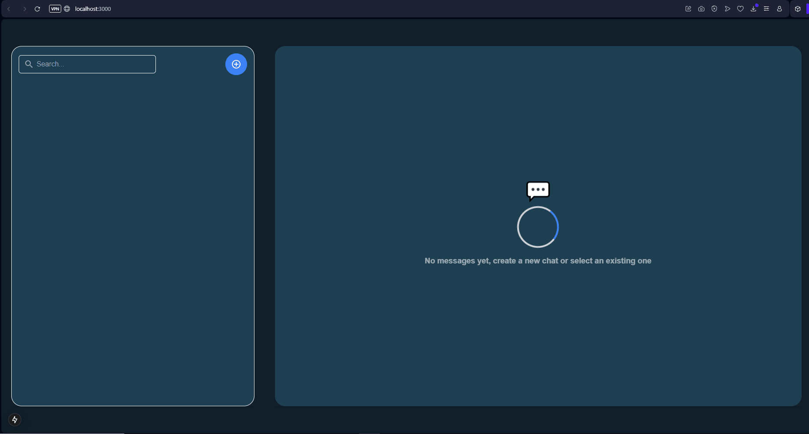

# 🚀 **Chat Frontend App - Real-Time Messaging with Next.js and WebSockets**

This is a **Next.js-based Chat Application** that connects to a backend API built with FastAPI, supporting **real-time messaging, user presence updates, and multimedia content** (text, image, audio). It also integrates WebSockets for real-time updates and ensures a seamless user experience.



---

## 📚 **Table of Contents**
1. [⚙️ Prerequisites](#️-prerequisites)  
2. [🛠️ Installation](#️-installation)  
3. [🚀 Running the Project](#-running-the-project)  
4. [📡 WebSocket Integration](#-websocket-integration)  
5. [💻 Available Scripts](#-available-scripts)  
6. [📖 Project Features](#-project-features)  
7. [📝 API Reference](#-api-reference)  
8. [🙌 Contributing](#-contributing)  
9. [📜 License](#-license)  

---

## ⚙️ **Prerequisites**

Make sure you have the following tools installed:

- [Node.js](https://nodejs.org/) **v18+**
- [npm](https://www.npmjs.com/) **v8+**
- [Docker](https://www.docker.com/) *(optional but recommended for backend API)*
- Backend API running on `http://localhost:8000` *(follow backend setup instructions if not already running)*

---

## 🛠️ **Installation**

Clone the repository:

```bash
git clone <repository-url>
cd <repository-folder>
```

Install the project dependencies:
```bash
npm install
# or
yarn install
# or
pnpm install

```

---

## 🚀 **Running the Project**

Start the development server:

```bash
npm run dev
# or
yarn dev
# or
pnpm dev
```

Open your browser and visit:

👉 http://localhost:3000

**Environment Variables**

Ensure you have the following environment variables in a .env.local file:

```bash
  NEXT_PUBLIC_API_URL=http://localhost:8000
```

---

## 📡 **WebSocket Integration**

The application supports real-time updates via WebSockets. The WebSocket server must be accessible at:

```bash
  ws://localhost:8000/ws/{chat_id}
```

Replace **``{chat_id}``** with the appropriate chat identifier.

---

## 💻 **Available Scripts**

- **``npm run dev:``** Starts the development server.
- **``npm run build:``** Builds the application for production.
- **``npm start:``** Starts the production server.
- **``npm run lint:``** Runs ESLint for code quality checks.

---

## 📖 **Project Features**

#### ✅ **Core Features**  
- Create and join **chat rooms**.  
- Real-time messaging (**text**, **image**, **audio**).  
- User presence indicators: **Online**, **Offline**, **Typing**.  
- Message **read receipts**.  

#### ✨ **Enhanced UI/UX**  
- Interactive design with **TailwindCSS**.  
- **Smooth animations** for chat events.  
- **Responsive layout** for mobile and desktop.  

#### 🔗 **Real-time Integration**  
- Real-time updates via **WebSocket** for:  
   - **Messages**  
   - **User presence**  
   - **Read receipts**  

#### 📝 **Code Quality**  
- **Modular architecture**.  
- **Clean and reusable components**.  
- **TypeScript** for robust typing and maintainability.  

---

## 📝 **API Reference**

The application communicates with a **FastAPI backend**. Below are the key endpoints:

#### 1️⃣ **Create Chat**  
- **Method:** `POST`  
- **Endpoint:** `/chats`  
- **Body:**  
   ```json
   {
     "participants": ["user1", "user2"]
   }
   ```

#### 2️⃣  **List Chats**  
- **Method:** `GET`  
- **Endpoint:** `/chats`  

#### 3️⃣ **Get Messages**  
- **Method:** `GET`  
- **Endpoint:** `/chats/{chat_id}/messages`  

#### 4️⃣ **Send Message**  
- **Method:** `POST`  
- **Endpoint:** `/chats/{chat_id}/messages`  
- **Body:**  
   ```json
    {
      "user_id": "user1",
      "type": "text",
      "content": "Hello!"
    }
   ```

#### 5️⃣ **Update Presence**  
- **Method:** `POST`  
- **Endpoint:** `/chats/{chat_id}/presence`  
- **Body:**  
   ```json
   {
     "user_id": "user1",
     "status": "online"
   }
   ```

#### 6️⃣ **Mark Chat as Read**  
- **Method:** `POST`  
- **Endpoint:** `/chats/{chat_id}/read`  
- **Body:**  
   ```json
   {
     "user_id": "user1",
   }
   ```

**📚 Refer to the backend documentation for more details.**

---
## 🙌 **Contributing**

We welcome contributions! Follow these steps to contribute:

1. **Fork the Repository**  
   Click on the **Fork** button at the top-right corner of this repository.

2. **Clone Your Fork**  
   ```bash
    git clone https://github.com/your-username/project-name.git
   ```
3. **Create a New Branch**
   ```bash
    git checkout -b feature/new-feature
   ```
4. **Make Your Changes**
   Implement your feature or fix.

5. **Commit Your Changes**
   ```bash
    git commit -m "Add new feature"
   ```

6. **Push to Your Fork**
   ```bash
    git push origin feature/new-feature
   ```

7. **Submit a Pull Request**
   Open a Pull Request from your branch to the main repository.


#### **🛠️ Thank you for helping us improve! 🚀**

---

## 📜 **License**

This project is licensed under the **MIT License**.

---
